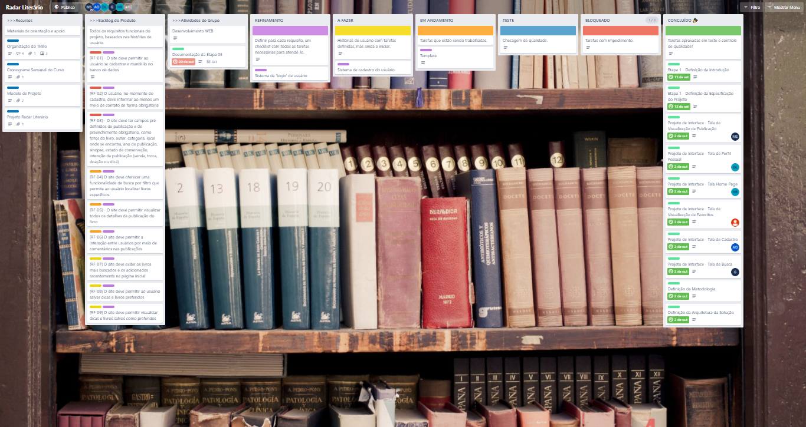
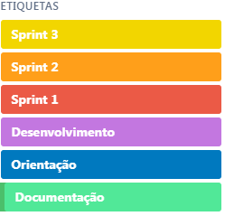

# Metodologia

A metodologia contempla as definições de ferramental utilizado pela equipe tanto para a manutenção dos códigos e demais artefatos quanto para a organização do time na execução das tarefas do projeto.

## Controle de Versão

A ferramenta de controle de versão adotada no projeto foi o
[Git](https://git-scm.com/), sendo que o [Github](https://github.com)
foi utilizado para hospedagem do repositório.

O projeto segue a seguinte convenção para o nome de branches:

- `main`: versão estável já testada do software
- `testing`: versão em testes do software
- `dev`: versão de desenvolvimento do software

Quanto à gerência de issues, o projeto adota a seguinte convenção para
etiquetas:

- `documentation`: melhorias ou acréscimos à documentação
- `bug`: uma funcionalidade encontra-se com problemas
- `enhancement`: uma funcionalidade precisa ser melhorada
- `feature`: uma nova funcionalidade precisa ser introduzida

## Gerenciamento de Projeto

A equipe utiliza metodologias ágeis, tendo escolhido o Scrum como base para definição do processo de desenvolvimento.

### Divisão de Papéis

A equipe está organizada da seguinte maneira:
* Scrum Master
  * Wendy Louise Maruch Artiaga
* Product Owner
  * Mychel Costa da Silva
* Equipe de Desenvolvimento
  * Alison Welton Pires de Oliveira
  * Álvaro Alfaya Fonseca
  * Denio Gonçalves de Lima
  * Gabrielle Alcantara Reis Silva
  * Hestefani Romão Durães

### Processo

Para organização e distribuição das tarefas do projeto, a equipe está utilizando um quadro Kanban no Trello estruturado com as seguintes listas:
* Recursos: esta lista mantém materiais de orientação e apoio.
* Backlog do Produto: esta lista recebe todas as histórias de usuário a serem trabalhadas no projeto de software.
* Atividades do Grupo: esta lista recebe todas as atividades da equipe para desenvolvimento da documentação do projeto.
* Refinamento: nesta lista são incluídas as histórias de usuário que estão sendo refinadas, definindo o esforço necessário para implementá-las.
* A Fazer: nesta lista são incluídas as histórias de usuário que já tenham suas tarefas definidas, pronta para serem iniciadas.
* Em Andamento: nesta lista são incluídas as histórias de usuário cujas tarefas estão sendo trabalhadas.
* Teste: trata-se da checagem de qualidade. Quando as tarefas são concluídas, elas são movidas para esta lista a fim de serem testadas.
* Bloqueado: se uma tarefa possui algum impedimento, ela é movida para esta lista juntamente com um comentário sobre o que está travando a tarefa.
* Concluído: nesta lista são colocadas as tarefas que passaram pelos testes e controle de qualidade e estão prontos para ser entregues ao usuário. 

    

Na imagem acima, é apresentado, no estado atual, o quadro Kanban do grupo que está [disponível no Trello](https://trello.com/b/I0lbAQcR/radar-literário).

<table>
    <tr>
        <td>
            
        </td>
        <td>
            

                As tarefas são, ainda, etiquetadas em função da natureza da atividade e seguem o seguinte esquema de cores/categorias, conforme a figura ao lado.
                <ul>
                    <li>Sprint 3</li>
                    <li>Sprint 2</li>
                    <li>Sprint 1</li>
                    <li>Desenvolvimento</li>
                    <li>Orientação</li>
                    <li>Documentação</li>
                </ul>
            
 
        </td>
    </tr>
</table>

### Ferramentas

As ferramentas empregadas no projeto são:

- **Visual Studio Code** como editor de código.
- **WhatsApp** e **Discord** como ferramentas de comunicação, com o **Discord** sendo usado apenas para reuniões do grupo por audioconferência.
- **Figma** para desenho de tela (_wireframing_).
- **GitHub** como repositório remoto do código-fonte.
- **Trello** para gerenciar o quadro Kanban do projeto.

O editor de código foi escolhido por ser de fácil adaptação e porque ele possui uma integração com o sistema de versão. Também foram utilizadas ferramentas de comunicação que já são usadas pelos membros do grupo. Por fim, para projetar a interface utilizamos o **Figma** por sua maior popularidade, tornado mais fácil a procura por informações para suporte.