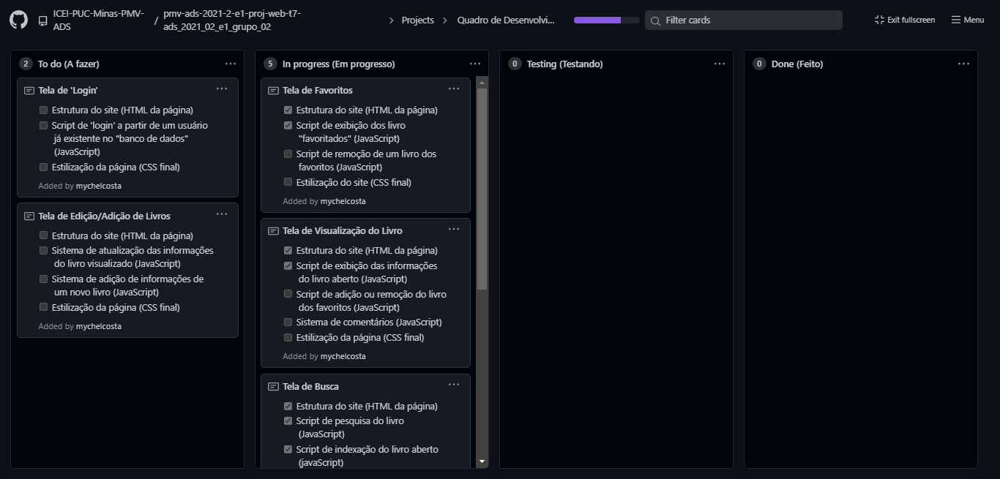
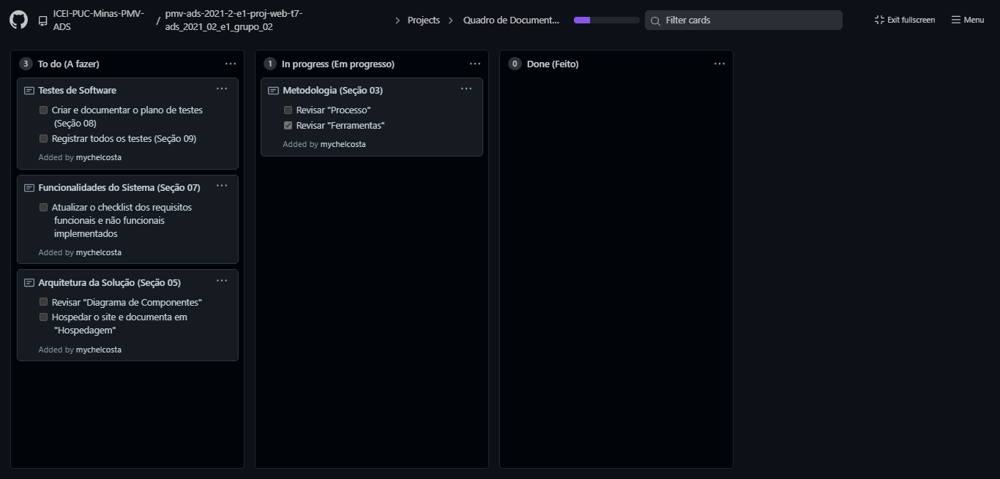

# Metodologia

A metodologia contempla as definições de ferramental utilizado pela equipe tanto para a manutenção dos códigos e demais artefatos quanto para a organização do time na execução das tarefas do projeto.

## Controle de Versão

A ferramenta de controle de versão adotada no projeto foi o
[Git](https://git-scm.com/), sendo que o [Github](https://github.com)
foi utilizado para hospedagem do repositório.

O projeto segue a seguinte convenção para o nome de branches:

- `main`: versão estável já testada do software
- `testing`: versão em testes do software
- `dev`: versão de desenvolvimento do software

Quanto à gerência de issues, o projeto adota a seguinte convenção para
etiquetas:

- `documentation`: melhorias ou acréscimos à documentação
- `bug`: uma funcionalidade encontra-se com problemas
- `enhancement`: uma funcionalidade precisa ser melhorada
- `feature`: uma nova funcionalidade precisa ser introduzida

## Gerenciamento de Projeto

A equipe utiliza metodologias ágeis, tendo escolhido o Scrum como base para definição do processo de desenvolvimento.

### Divisão de Papéis

A equipe está organizada da seguinte maneira:
* Scrum Master
  * Gabrielle Alcantara Reis Silva
  * <s>Wendy Louise Maruch Artiaga</s>
* Product Owner
  * Mychel Costa da Silva
* Equipe de Desenvolvimento
  * Alison Welton Pires de Oliveira
  * Álvaro Alfaya Fonseca
  * Denio Gonçalves de Lima
  * Hestefani Romão Durães

### Processo

Para organização e distribuição das tarefas do projeto, a equipe está utilizando dois quadros Kanban para desenvolvimento e documentação no GitHub estruturados com as seguintes listas:

* Quadro de Desenvolvimento
  * To do (A Fazer): nesta lista são incluídas as histórias de usuário que já tenham suas tarefas definidas, pronta para serem iniciadas.
  * In progress (Em progresso): nesta lista são incluídas as tarefas que estão sendo trabalhadas.
  * Testing (Testando): trata-se da checagem de qualidade. Quando as tarefas são concluídas, elas são movidas para esta lista a fim de serem testadas.
  * Done (Feito): nesta lista são colocadas as tarefas que passaram pelos testes e controle de qualidade e estão prontas para serem entregues ao usuário.

    

* Quadro de Documentação
  * To do (A Fazer): nesta lista são incluídas as tarefas que precisam ser documentadas ou atualizadas.
  * In progress (Em progresso): nesta lista são incluídas as tarefas que estão sendo trabalhadas.
  * Done (Feito): nesta lista são colocadas as tarefas que já estão prontas.

    

Nas imagens acima, são apresentados, no estado em que estavam no dia 24 de novembro de 2021, os quadros Kanban do grupo que estão [disponíveis na aba "Projects" do GitHub](https://github.com/ICEI-PUC-Minas-PMV-ADS/pmv-ads-2021-2-e1-proj-web-t7-ads_2021_02_e1_grupo_02/projects).

### Ferramentas

As ferramentas empregadas no projeto são:

- **Visual Studio Code** como editor de código.
- **WhatsApp**, **Discord** e **Visual Studio Code** como ferramentas de comunicação, com o **Discord** sendo usado apenas para reuniões do grupo por audioconferência e a extensão "[Visual Studio Live Share](https://visualstudio.microsoft.com/pt-br/services/live-share/)" para compartilhamento remoto do terminal e do código em situações específicas.
- **Figma** para desenho de tela (_wireframing_).
- **GitHub** como repositório remoto do código-fonte e para gerenciar o projeto por meio de quadros no modelo Kanban.

O editor de código foi escolhido por ser de fácil adaptação e porque ele possui uma integração com o sistema de versão, além de possuir muitas outras integrações através de extensões. Também foram utilizadas ferramentas de comunicação que já são usadas pelos membros do grupo. Por fim, para projetar a interface utilizamos o **Figma** por sua maior popularidade, tornado mais fácil a procura por informações para suporte.