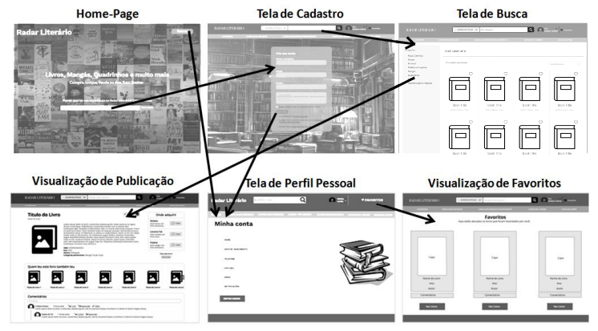

# Projeto de Interface

Dentre as preocupações para a montagem da interface do sistema, estamos estabelecendo foco em questões como,  acessibilidade e usabilidade. Desta forma, o projeto tem uma identidade visual padronizada em todas as telas que são projetadas para funcionamento em desktops e dispositivos móveis.

## User Flow

    

O diagrama apresentado na imagem mostra o fluxo de interação do usuário pelas telas do sistema. Cada uma das telas deste fluxo é detalhada na seção de Wireframes que se segue. Para visualizar o wireframe interativo, acesse o [ambiente no Figma do projeto](https://www.figma.com/proto/ZkRNBV5rK7kqQRycZp5Yip/Projeto-Radar-Liter%C3%A1rio?scaling=scale-down-width).

## Wireframes

Conforme fluxo de telas do projeto, apresentado no item anterior, as telas do sistema são  apresentadas  em  detalhes  nos  itens  que  se  seguem.  As  telas  do  sistema apresentam uma estrutura comum que é apresentada na figura abaixo.

<table>
    <tr>
        <td>
            
        </td>
        <td>
            

                Nesta estrutura, existem 3 grandes blocos, descritos a seguir. São eles:
                <ul>
                    <li><b>Cabeçalho</b> - local onde são dispostos elementos fixos de identidade (logo); campo de busca, acesso à conta pessoal e favoritos;</li>
                    <li><b>Menu</b> - elementos de navegação;</li>
                    <li><b>Conteúdo</b> - apresenta o conteúdo da tela em questão.</li>
                </ul>
            

        </td>
    </tr>
</table>

### Tela de home-page

A tela  de home-page, é a tela inicial do website. Com base na estrutura padrão, o bloco de conteúdo apresenta a proposta e o conteúdo encontrado.
- Componente de *Criar conta*, no qual o usuário insere seu email e é levado à tela de cadastro de conta;
- Componente de *Entrar* que direciona o usuário ao login.

    
    

        <i>(Feito por: Hestefani Romão)</i>
    

### Tela de Cadastro Inicial

A tela de cadastro apresenta, no bloco de conteúdo, campos de preenchimento referentes a dados pessoais do usuário. O bloco do cabeçalho campo de busca, acesso à conta pessoal e aos favoritos.

    
    

        <i>(Feito por: Alison Pires)</i>
    

### Tela de Busca

Assim que o usuário informa um tópico de pesquisa, ao clicar no ícone lupa ele é encaminhado para uma tela de busca com filtros, no qual ele pode direcionar os resultados quanto à localização, categoria, autor, ano de publicação, sinopse, estado de conservação e intenção da publicação (venda, troca, doação ou dica), conforme a figura a seguir.

    
    

        <i>(Feito por: Gabrielle Alcantara)</i>
    

### Tela de Visualização de Publicação

Ao selecionar uma das opções de publicação resultantes da pesquisa, é possível visualizar detalhes das dicas ou oferta de livros associados ao tópico informado. Este resultado é apresentado na figura a seguir.

    
    

        <i>(Feito por: Mychel Costa)</i>
    

### Tela de Visualização de Favoritos

A tela retratada na figura abaixo permite ao usuário visualizar todas as dicas e publicações favoritadas por ele. Pode ser acessada em todas as telas de navegação, através do ícone coração localizado no canto superior direito das telas.

    
    

        <i>(Feito por: Álvaro Alfaya)</i>
    

### Tela de Perfil Pessoal

A tela apresenta os dados pessoais de cadastro do usuário e pode ser acessada em todas as telas de navegação, através do ícone arredondado de boneco em pictograma, localizado no canto superior direito das telas.

    
    

        <i>(Feito por: Dênio Lima)</i>
    

