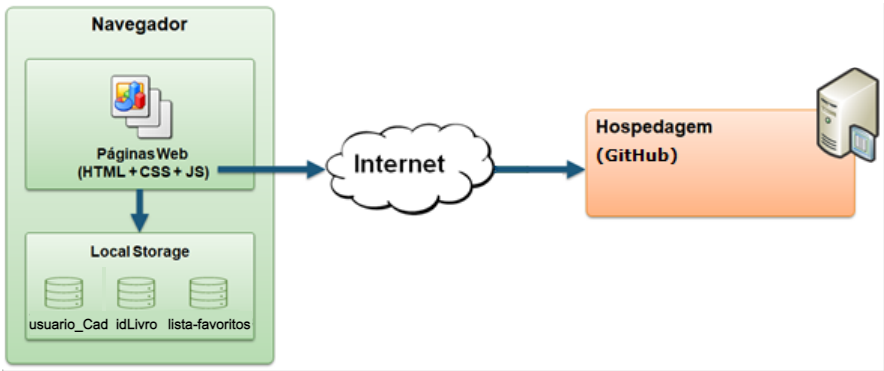

# Arquitetura da Solução

## Diagrama de componentes

Os componentes que fazem parte da solução são apresentados na imagem abaixo.

    
    

      <i>Arquitetura da Solução</i>
    

A solução implementada conta com os seguintes módulos:
- **Navegador** - Interface básica do sistema  
  - **Páginas Web** - Conjunto de arquivos HTML, CSS, JavaScript e imagens que implementam as funcionalidades do sistema.
   - **Local Storage** - armazenamento mantido no Navegador, onde são implementados bancos de dados baseados em JSON. São eles: 
     - **Livros** - seções de livros apresentadas 
     - **Comentários** - registro de opiniões dos usuários sobre as notícias
     - **Favoritos** - lista de livros favoritados pelo usuário para leitura e acesso posterior
 - **Hospedagem** - local na Internet onde as páginas são mantidas e acessadas pelo navegador. 

## Hospedagem

O site utiliza a plataforma GitHub como ambiente de hospedagem do site do projeto. O site é mantido no ambiente da URL:

https://link_exemplo.github.io
