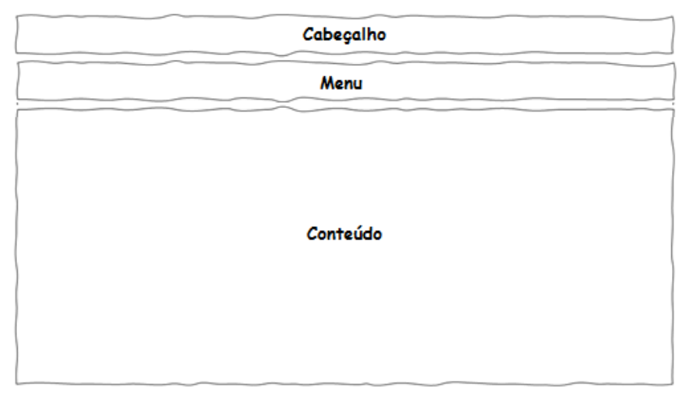

# Template padrão do site

O padrão de layout a ser utilizado pelo site tem correspondência ao projeto de Interface elaborado anteriormente, conforme a imagem:

    

O template criado está disponível em [Projeto de Interface](04-Projeto%20de%20Interface.md) e é composto pelos seguintes layouts:
* Tela inicial
* Tela principal do site

## Tela Inicial

Este layout é utilizado apenas para as telas iniciais: a página inicial do site e a tela de cadastro ou "login".

    

## Tela Principal do Site

Tela que abrange todas as visualizações do site após as telas iniciais, desde a tela de busca até a visualização das informações de um livro, favoritos ou o perfil do usuário com os dados cadastrados.

    

