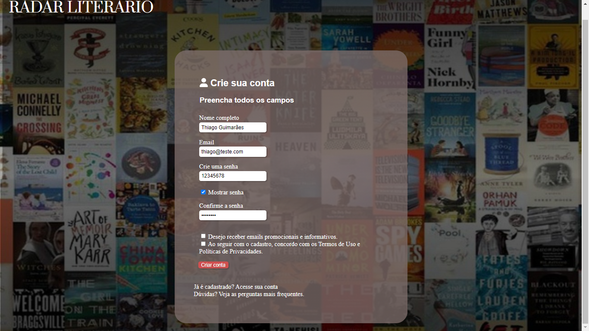
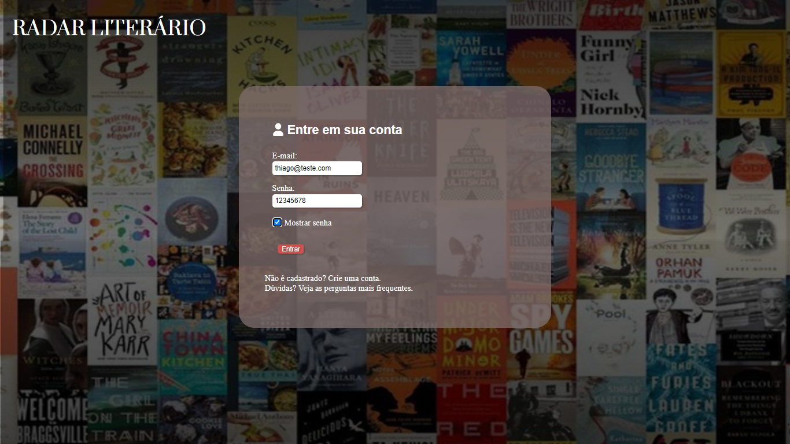
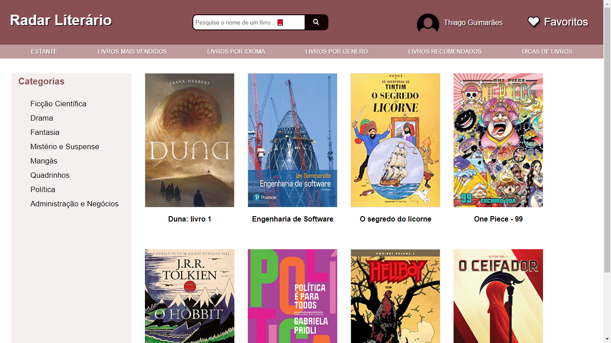
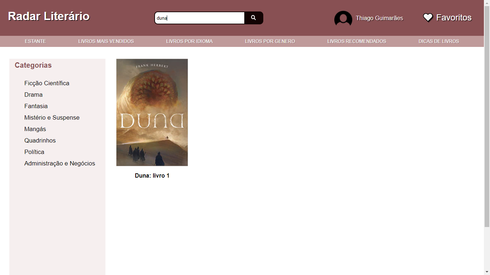
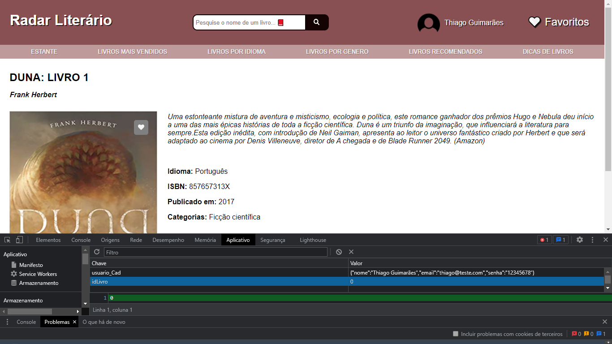

# Registro de Testes de Software

|Caso de Teste | Resultado                              |
|--|-------------------------------------------------------|
|CT-01|   Foram informados dados de cadastro que foram armazenados no localStorage com sucesso.|
|CT-02|   Foram informados os dados de acesso cadastrados e o site funcionou como esperado.|
|CT-03|  O site realizou a filtragem dos livros com sucesso.|
|CT-04|  As informações do livro são apresentadas na tela.|
|CT-05||
|CT-06||
|CT-07||