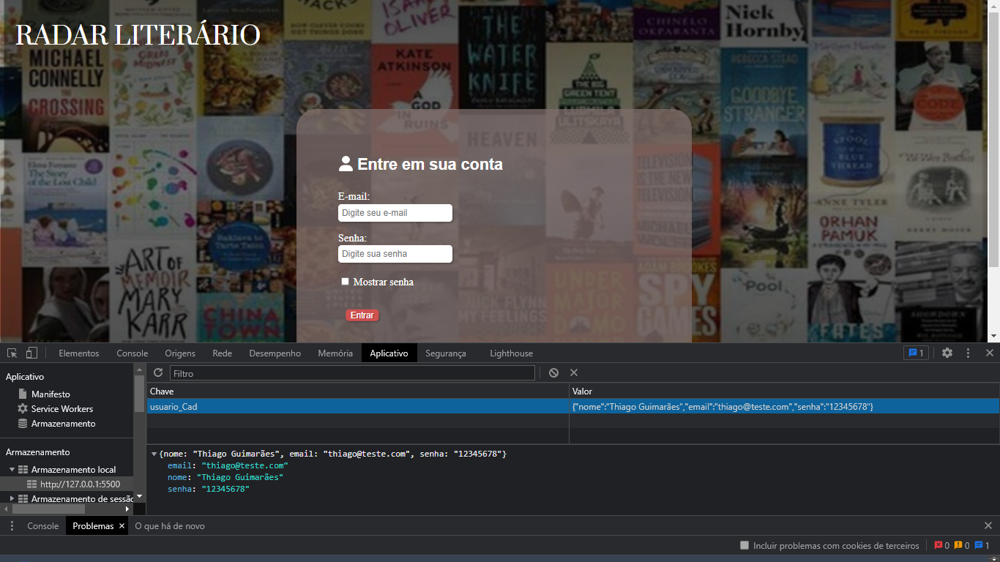

# Registro de Testes de Software

|Caso de Teste | Resultado                              |
|--|-------------------------------------------------------|
|CT-01|Foram informados dados de cadastro que foram armazenados no localStorage com sucesso.   |
|CT-02|Foram informados os dados de acesso cadastrados anteriormente e o site funcionou como esperado.   |
|CT-03|O site realizou a filtragem dos livros com sucesso.  |
|CT-04|O valor do livro clicado é armazenado em "idLivro" e as informações do livro selecionado são apresentadas na tela como esperado no teste.  |
|CT-05|O livro foi adicionado a uma lista no localStorage e apresentado na tela de favoritos como esperado e depois removido.    |
|CT-06|Os dados cadastrados pelo usuário puderam ser vistos em "meus_dados.html" e atualizados com sucesso.    |